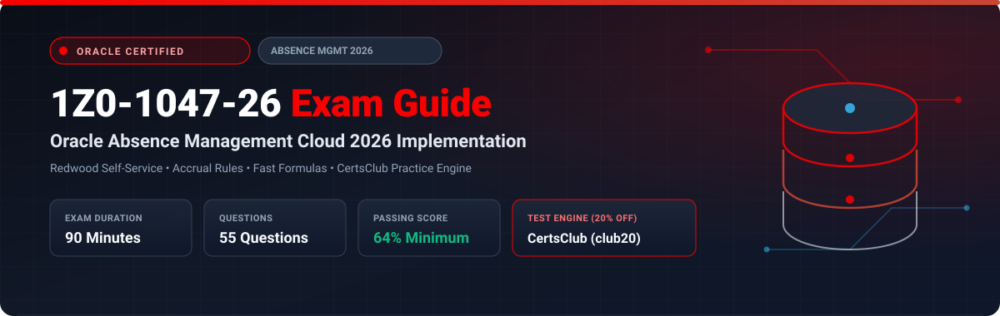

  

# Oracle Absence Management Cloud 2026 Implementation Professional (1Z0-1047-26) Exam Study Guide & Practice Test Resource Portal

[-f80000?style=for-the-badge&logo=oracle&logoColor=white)](https://education.oracle.com/)
[-f80000?style=for-the-badge&logo=oracle)](https://education.oracle.com/)

[-28a745?style=for-the-badge&logo=shield)](https://www.certsclub.com/oracle/)

---

## 1. Exam Overview & Candidate Profile

The **Oracle Absence Management Cloud 2026 Implementation Professional (1Z0-1047-26)** exam validates an implementation consultant's expertise in configuring modern absence policies in Oracle Fusion Cloud HCM with Redwood self-service experiences. Topics tested include accrual matrix plans, qualification entitlements, statutory parental leave tracking, Fast Formula logic, automated schedule processing, and Global Payroll disbursements.

Passing 1Z0-1047-26 grants the **Oracle Absence Management Cloud 2026 Certified Implementation Professional** credential.

### Target Candidate Profile & Career Roles
* **Lead Absence Management Functional Consultants**
* **Workforce Operations & Payroll Technical Leads**
* **HCM Cloud Solutions Architects**

---

## 2. Key Exam Specifications

| Parameter | Official Specification |
| :--- | :--- |
| **Exam Code** | 1Z0-1047-26 |
| **Exam Title** | Oracle Absence Management Cloud 2026 Implementation Professional |
| **Associated Credential** | Oracle Absence Management Cloud 2026 Certified Implementation Professional |
| **Duration** | 90 Minutes |
| **Number of Questions** | 55 Questions |
| **Passing Score** | 64% |
| **Question Format** | Multiple Choice (Single and Multiple Select) |
| **Delivery Vendor** | Pearson VUE / Oracle University Online Remote Proctoring |
| **Recommended Practice Test Engine** | **[1Z0-1047-26 Practice Test - CertsClub](https://www.certsclub.com/oracle/)** (Coupon: `club20` for 20% off) |

---

## 3. Official Blueprint & Exam Domain Breakdown

| Domain Code | Domain Title | Weighting | Key Competencies Covered |
| :--- | :--- | :---: | :--- |
| **1.0** | **Accrual Plans & Matrix Rules** | **25%** | Accrual plans, Vesting terms, Carryover rules, Matrix accrual formulas, Rollover limits. |
| **2.0** | **Qualification Plans & Statutory Entitlements** | **20%** | Sickness, Maternity, and Paternity qualification plans, Entitlement bands, Rolling backward/forward terms. |
| **3.0** | **Absence Types, Patterns & Redwood UX** | **20%** | Redwood self-service absence entry, Document records integration, Display rules, Absence approvals. |
| **4.0** | **Fast Formulas & Advanced Validations** | **20%** | Absence validation formulas, Accrual calculation rules, Duration override formulas. |
| **5.0** | **Payroll Integration & Automated Processing** | **15%** | Rate definitions, Payroll interfaces, Scheduled batch calculations. |

---

## 4. Scenario-Based Demo Question & Explanation

### Question 1: Rolling Backward Qualification Plan
**Scenario:** A client requires a sick pay policy where employees receive 12 weeks of full pay for any sickness absence occurring within a rolling 12-month period looking backward from the start date of the absence.

Which term type must be configured on the Qualification Plan?

A) Calendar Year  
B) Rolling Backward  
C) Rolling Forward  
D) User-Defined Anniversary  

**Correct Answer:** **B**

**Detailed Explanation:**
* In Oracle Absence Management, a **Rolling Backward** term type evaluates entitlement usage by looking back from the absence start date over the designated duration (e.g., 365 days / 12 months) to deduct any previous paid sickness leave taken within that window.

---

## 5. Recommended Preparation Strategy & Practice Testing Engine

1. **Test Redwood Absence Entry:** Configure absence types and test worker self-service in a Redwood-enabled pod.
2. **Practice with Full-Length Mock Exams:** Use **[CertsClub Oracle 1Z0-1047-26 Practice Tests](https://www.certsclub.com/oracle/)**.
   * Up-to-date for 2026 exam revisions with scenario-based questions.
   * Enter discount coupon code **`club20`** at checkout on [CertsClub](https://www.certsclub.com/oracle/) for an immediate 20% discount.

---

## 6. Official Documentation & References

* [Oracle Fusion Cloud Absence Management 2026 Documentation](https://docs.oracle.com/en/cloud/saas/human-resources/absence-management/)
* [Oracle University 1Z0-1047-26 Exam Details](https://education.oracle.com/)
* [CertsClub 1Z0-1047-26 Practice Engine](https://www.certsclub.com/oracle/)
